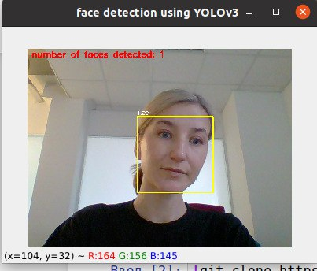

# Face detection darknet YOLOv3

Распознавание лиц в режиме реального времени, а также по изображению. Fine-tuning Yolov3 на своих классах с помощью фреймворка darknet. 

## Этапы реализации проекта

#### 1. Подготовка набора данных  
Разметка фотографий в makesense.ai, аугментация. Для результативного обучения желательно подготовить не менее 100 исходных изображений каждого класса.
#### 2. Настройка darknet  
Основная работа с Makefile, yolo-obj.cfg, obj.names, obj.data.  
#### 3. Скачивание предобученных весов  
darknet19_448.conv.23 (76 Mb) доступно   
#### 4. Дообучение Yolov3 на новых 3 классах  
#### 5. Анализ результатов  
Детекция лица по фотографии или в режиме реального времени с использованием веб-камеры.

## Используемые источники

* Статья - https://medium.com/@ashishkhan/face-detection-with-darknet-yolo-1b3d5d15e824
* Yoloface (детекция лиц в режиме реального времени) - https://github.com/sthanhng/yoloface  
* Аугментация изображений - https://github.com/Daniil193/NN_retraining

